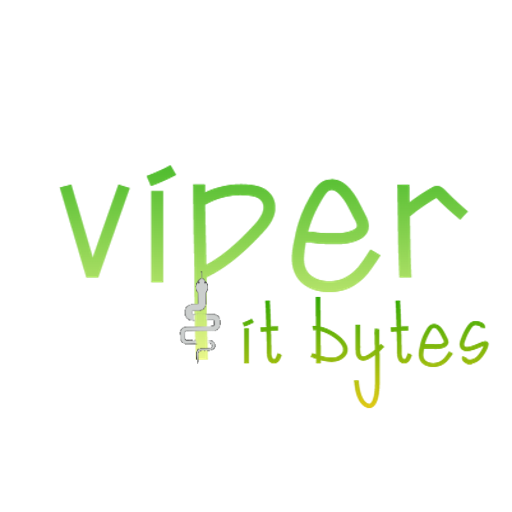

<!-- # Viper, it Bytes <small>1.0</small> -->

> *"Viper, it Bytes"* (pun intended) is a dynamically-typed, byte-interpreted programming language written in C.

- Byte interpreted Virtual Machine written in C.
- Python & JavaScript based Syntax with Dynamic typing.
- Lightweight interpreter (Compiled executable is <80KB).
- Support for Object Oriented Programming.

[GitHub](https://github.com/rahuldshetty/viper.git)
[Get Started](#viper-it-bytes)
